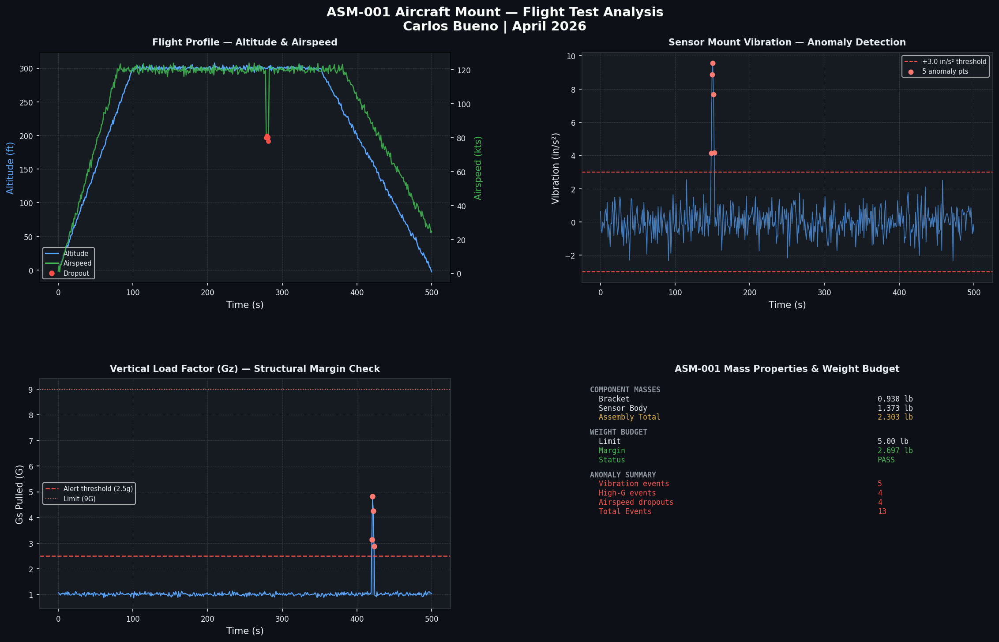

# Aircraft Research Sensor Mount
### Operations Flight Test Portfolio Project
**Author:** Carlos Bueno | **Date:** April 2026

---

## Project Overview

This project demonstrates an end-to-end aerospace engineering workflow for the design, analysis, and integration of a research sensor mount for aircraft flight tests directly aligned with NASA operations engineering requirements.

The project covers three engineering disciplines in one project:
- **CAD Design** — 3D bracket model and engineering drawing in Onshape
- **Risk Assessment** — Design FMEA following aerospace standards
- **Flight Data Analysis** — Python anomaly detection dashboard using real mass properties from the CAD model

---

## Repository Structure

```
Operations-Project/
│
├── cad/
│   ├── ASM-001_sensor_mount_drawing.pdf    # Design drawing
│   └── sensor_mount_assembly_render.png    # Onshape assembly screenshot
│
├── fmea/
│   └── ASM-001_Design_FMEA.xlsx            # Design FMEA
│
├── python/
│   ├── flight_data.py                      # Flight data generation
│   ├── sensor_analysis.py                  # Anlysis and dashboard
│   ├── flight_test_data.csv                # Generated flight data
│   ├── sensor_dashboard.png                # Output dashboard
│   └── requirements.txt                    # Python dependencies
│
└── README.md
```

---

## CAD Model — Onshape (ASM-001)

**Part:** Aircraft Research Sensor Mount
**Material:** 6061-T6 Aluminum
**Drawing Number:** ASM-001 | Rev 1.0 | April 2026

### Bracket Specifications

| Parameter | Value |
|---|---|
| Overall Height | 4.000 in |
| Base Length | 4.000 in |
| Base Depth | 3.000 in |
| Wall Thickness | 0.500 in |
| Sensor Bore Diameter | Ø2.000 in |
| Mounting Holes | 4x Ø0.250 THRU |
| Fillet Radius (inner) | 0.250 in |
| Material | 6061-T6 Aluminum |

### Mass Properties (from Onshape export)

| Component | Mass | Volume |
|---|---|---|
| Bracket only | 0.930 lb | 9.467 in³ |
| Air Data Sensor Body | 1.373 lb | 13.974 in³ |
| **Assembly Total** | **2.303 lb** | **23.441 in³** |

**Assembly Center of Gravity:**
- X: -0.256 in | Y: ≈0.000 in | Z: -1.174 in

### Design Decisions

- **4-bolt pattern** chosen over 3-bolt for load path redundancy — if one fastener loosens under vibration, 3 remaining fasteners maintain structural integrity
- **0.250 in inner fillet** at wall-to-base junction addresses the highest stress concentration point identified in the FMEA
- **2.000 in sensor bore** sized for a research instrumentation pod consistent with NASA AFRC instrument packages flown on research aircraft
- **6061-T6 aluminum** selected for optimal strength-to-weight ratio in aerospace structural applications

---

## Design FMEA

**File:** `FMEA/ASM-001_Design_FMEA.xlsx`

### Severity Scale (MIL-STD-1629A aligned)
| Score | Category | Definition |
|---|---|---|
| 9–10 | Catastrophic | May cause death or loss of aircraft |
| 7–8 | Critical | Mission loss or major system damage |
| 4–6 | Marginal | Mission degradation or minor damage |
| 1–3 | Minor | Unscheduled maintenance only |

### Detection Scale
| Score | Meaning |
|---|---|
| 1–2 | Almost certain to detect |
| 3–4 | High likelihood of detection |
| 5–6 | Moderate detection capability |
| 7–8 | Low detection capability |
| 9–10 | Cannot detect |

### Action Threshold
- **RPN ≥ 100** → Corrective action required
- **Severity ≥ 9** → Corrective action required regardless of RPN

---

## Python Analysis — Flight Test Dashboard

**Files:** `python/generate_flight_data.py` + `python/sensor_mount_analysis.py`

### Dashboard Output



---

## Technologies Used

- **Onshape** — CAD modeling, assembly, engineering drawing
- **Python 3** — pandas, numpy, matplotlib
- **MIL-STD-1629A** — FMEA methodology
- **GitHub** — version control and portfolio hosting

